# Smart Student Planner

A premium, Apple HIG-inspired mobile application for academic task management, built with **React Native (Expo SDK 52)** and integrated with **Firebase Cloud services**. Designed to help university students organize their coursework, track deadlines, create custom modules, and manage their academic workload in real time.

---

## Features

- **Real-Time Authentication** — User registration and login utilizing Firebase Authentication.
- **Academic Progress Dashboard** — Visual overview card displaying completion rate, overdue counts, and stats (Total, Active, Completed, Overdue).
- **Task Management (CRUD)** — Create, view, edit, and delete tasks with details: title, academic module, due date, priority, and notes.
- **🤖 AI Task Breakdown (PLO 6.5)** — Decomposes complex coursework tasks into 4-5 actionable, checkable study milestones with estimated durations utilizing the Google Gemini 2.5 Flash model.
- **Dynamic Course Categories** — Create and delete custom course module labels inside Settings that dynamically populate the task form select sheets.
- **Interactive Dashboard Filtering** — Filter upcoming deadlines directly from the home screen by task name, due date (Today, This Week, Overdue), and priority level (High, Medium, Low).
- **Local Settings Persistence** — Preferences like notification triggers, displaying completed tasks, deletion confirmation alerts, and default sort choices are persisted via AsyncStorage.
- **Profile Summary** — Displays user stats and personal metrics.
- **Responsive Layout** — Visually cohesive light theme built using modular spacing tokens, optimized for both iOS and Android platforms.

---

## Application Screen Gallery

### 📱 Onboarding & Splash Flow
<table>
  <tr>
    <td>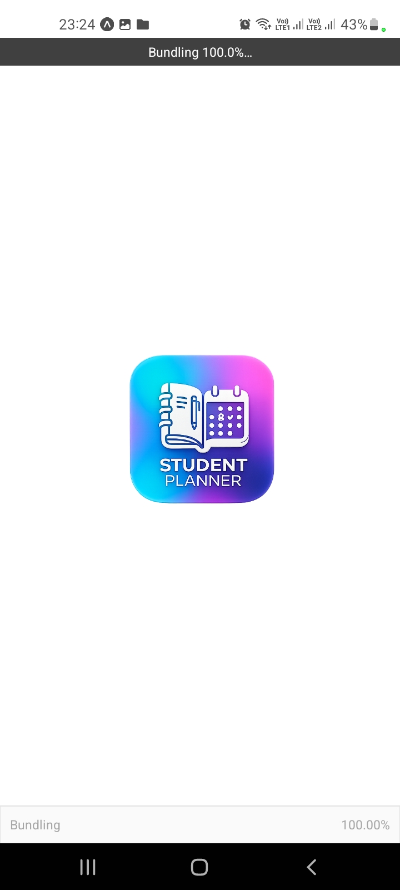</td>
    <td>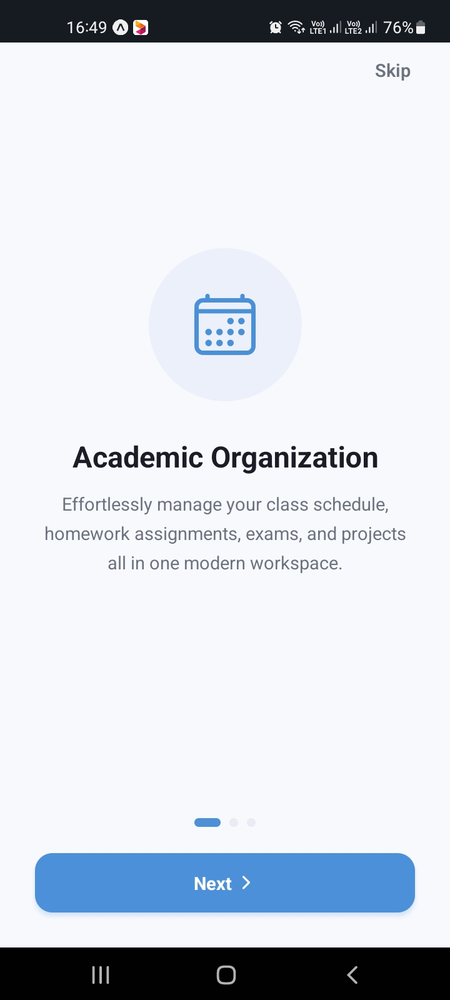</td>
    <td>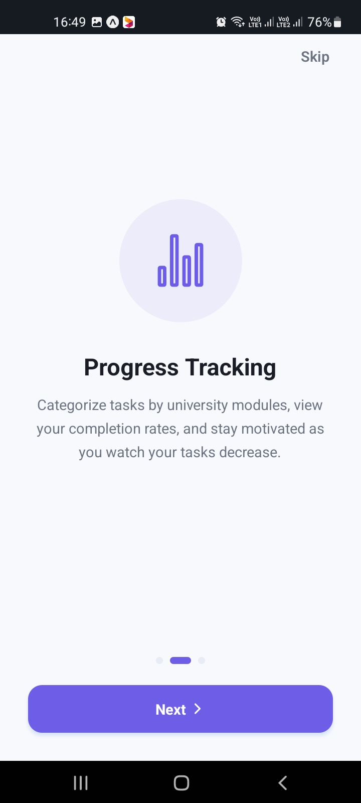</td>
    <td>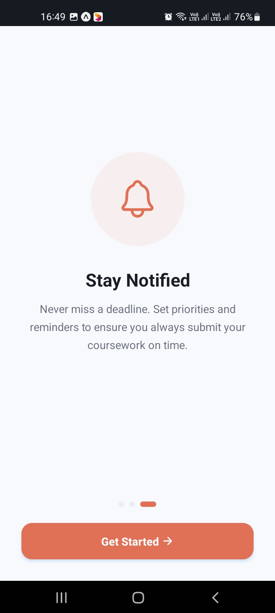</td>
  </tr>
  <tr>
    <td align="center"><b>01. Launch Splash</b></td>
    <td align="center"><b>02. Organize View</b></td>
    <td align="center"><b>03. Progress Metric</b></td>
    <td align="center"><b>04. Alert Notification</b></td>
  </tr>
</table>

### 🔑 Authentication & Landing
<table>
  <tr>
    <td>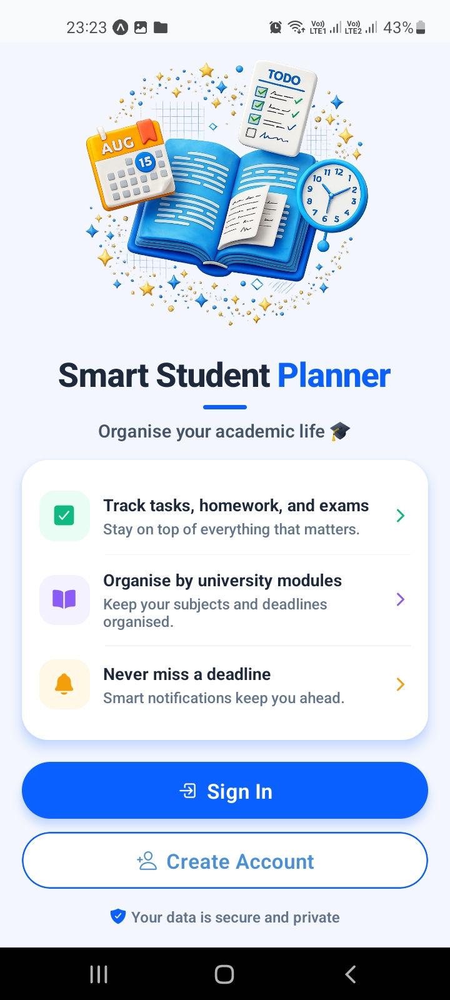</td>
    <td>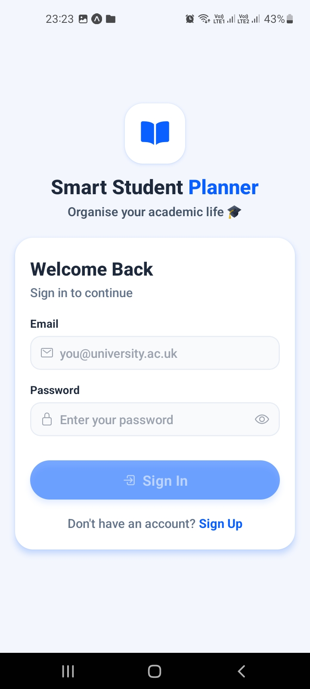</td>
    <td>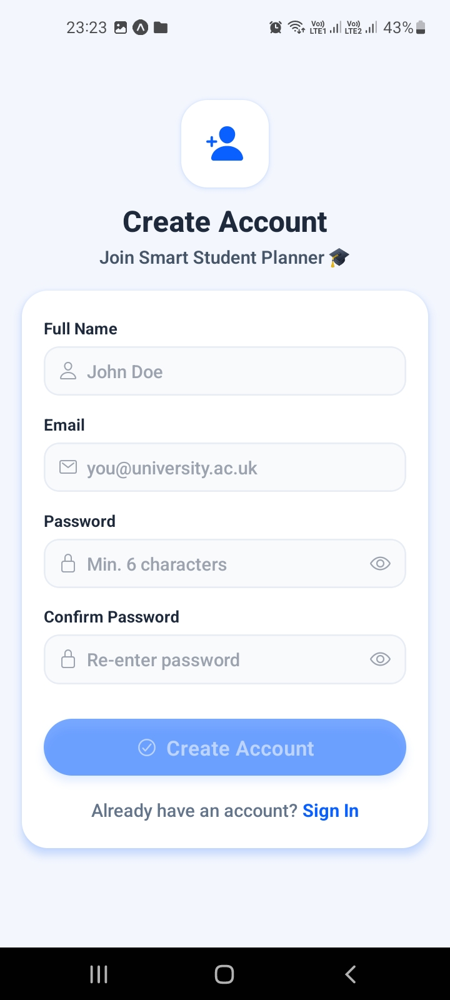</td>
  </tr>
  <tr>
    <td align="center"><b>05. Welcome Landing</b></td>
    <td align="center"><b>06. Login Screen</b></td>
    <td align="center"><b>07. Register Screen</b></td>
  </tr>
</table>

### 📈 Core Dashboard & Filters
<table>
  <tr>
    <td>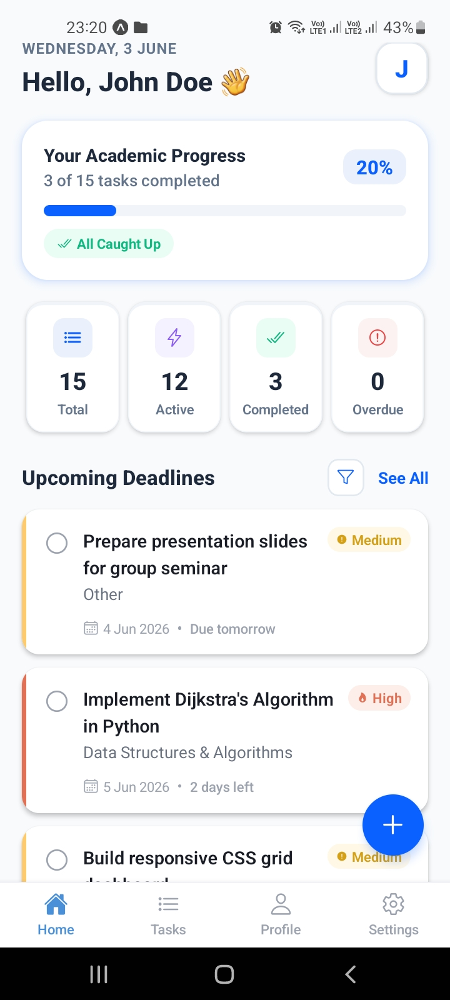</td>
    <td>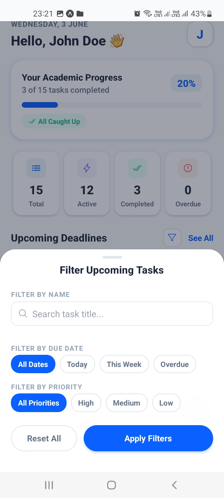</td>
    <td>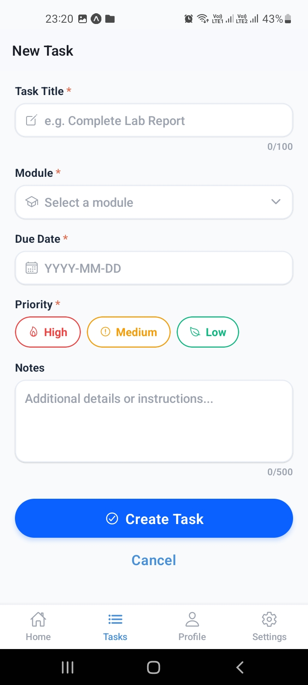</td>
  </tr>
  <tr>
    <td align="center"><b>08. Progress Dashboard</b></td>
    <td align="center"><b>09. Interactive Filters</b></td>
    <td align="center"><b>10. Add Task Creator</b></td>
  </tr>
</table>

### 🤖 Task Details & AI breakdown Flow (PLO 6.5)
<table>
  <tr>
    <td>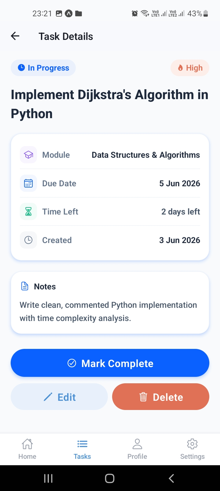</td>
    <td>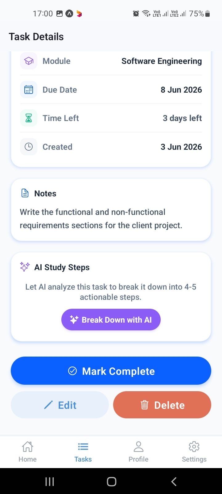</td>
    <td>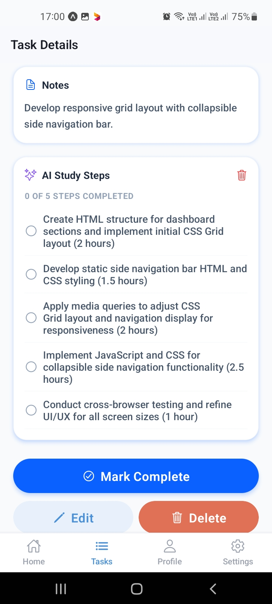</td>
  </tr>
  <tr>
    <td align="center"><b>11. Detailed Task Spec</b></td>
    <td align="center"><b>12. AI Breakdown Prompt</b></td>
    <td align="center"><b>13. AI Checklist Generated</b></td>
  </tr>
</table>

### ⚙️ Profile & System Settings
<table>
  <tr>
    <td>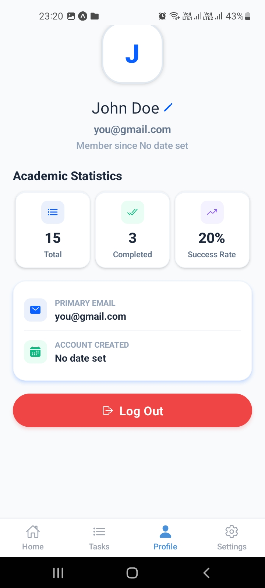</td>
    <td>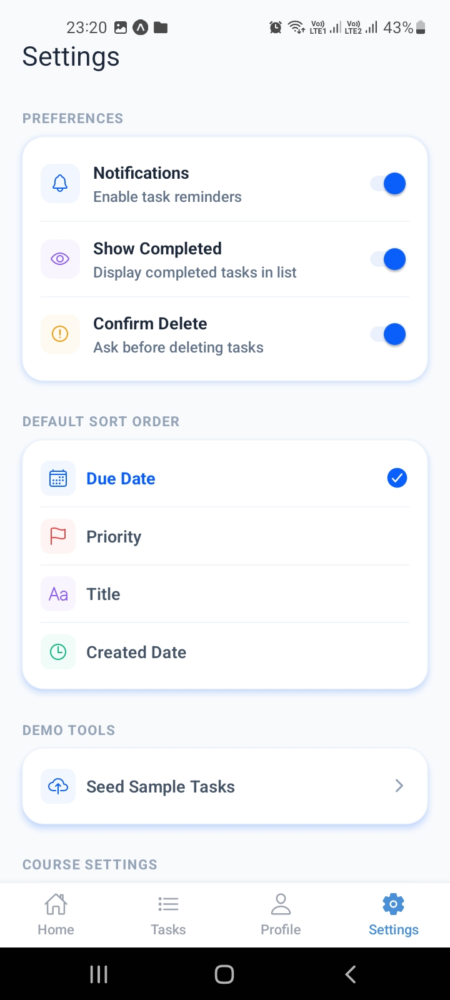</td>
    <td>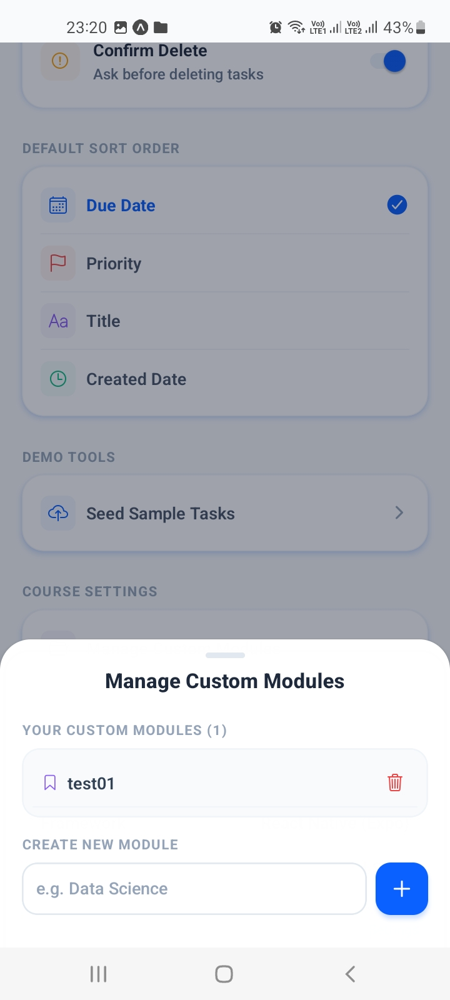</td>
  </tr>
  <tr>
    <td align="center"><b>14. Profile Stats</b></td>
    <td align="center"><b>15. Settings Panel</b></td>
    <td align="center"><b>16. Custom Modules manager</b></td>
  </tr>
</table>

---

## Tech Stack

| Technology | Version | Purpose |
|------------|---------|---------|
| React Native | 0.76.9 | Native mobile core framework |
| Expo SDK | 52.0.0 | Managed development workflow |
| Firebase SDK | 12.14.0 | Real-time database & auth service |
| Google Gemini API | v1beta | Deconstructs coursework tasks via gemini-2.5-flash |
| React Navigation | 6.x | Navigation (Stack & Bottom Tabs) |
| AsyncStorage | 1.23.1 | Local preferences storage |
| Expo Vector Icons | 14.x | Ionicons icon pack |
| React | 18.3.1 | UI library |

---

## Architecture

The application implements the **MVVM (Model-View-ViewModel)** architectural pattern:

- **Model** — Firestore database client API, `StorageService` (AsyncStorage local driver), and `ValidationService`.
- **ViewModel** — `AuthContext` (manages auth state) and `TaskContext` (synchronizes task/module data in real time).
- **View** — Screens and custom UI components styled via design tokens.

See [`docs/ARCHITECTURE.md`](docs/ARCHITECTURE.md) for more details.

---

## Project Structure

```
SmartStudentPlanner/
├── App.js                          # Application entry point
├── app.json                        # Expo configuration configuration
├── package.json                    # Dependency and script list
├── src/
│   ├── config/
│   │   └── firebaseConfig.js       # Firebase credential connections
│   ├── context/                    # State contexts (ViewModel)
│   │   ├── AuthContext.js
│   │   └── TaskContext.js
│   ├── screens/                    # View screens (View)
│   │   ├── OnboardingScreen.js
│   │   ├── LandingScreen.js
│   │   ├── LoginScreen.js
│   │   ├── RegisterScreen.js
│   │   ├── DashboardScreen.js
│   │   ├── TaskListScreen.js
│   │   ├── AddTaskScreen.js
│   │   ├── EditTaskScreen.js
│   │   ├── TaskDetailScreen.js
│   │   ├── ProfileScreen.js
│   │   └── SettingsScreen.js
│   ├── components/                 # Reusable layout UI components
│   │   ├── CustomButton.js
│   │   ├── TaskCard.js
│   │   ├── PriorityBadge.js
│   │   ├── SearchBar.js
│   │   ├── StatCard.js
│   │   └── EmptyState.js
│   ├── navigation/                 # Screen routing
│   │   └── AppNavigator.js
│   ├── services/                   # Business data layer (Model)
│   │   ├── StorageService.js
│   │   └── ValidationService.js
│   ├── utils/
│   │   ├── constants.js            # Design/validation configuration
│   │   └── helpers.js              # Sorting and metrics math helpers
│   └── theme/
│       └── theme.js                # Core colors, border radii, spacings
├── assets/                         # Graphic banners, icon overlays, and splashtypes
└── docs/                           # Interactive documentation files
```

---

## Installation & Setup

### Prerequisites

- **Node.js** v18+ ([download](https://nodejs.org/))
- **npm** v9+
- **Expo Go** app installed on your Android/iOS mobile device.

### Steps

1. **Clone the repository**
   ```bash
   git clone https://github.com/YOUR_USERNAME/smart-student-planner.git
   cd smart-student-planner/SmartStudentPlanner
   ```

2. **Install node dependencies**
   ```bash
   npm install
   ```

3. **Configure Environment Variables (.env)**
   Create a `.env` file in the root directory (`SmartStudentPlanner/`) to configure your Google Gemini API key:
   ```env
   EXPO_PUBLIC_GEMINI_API_KEY=your_free_gemini_api_key_here
   ```
   *(Note: The `.env` file is ignored by `.gitignore` to prevent secret leaks to GitHub).*

4. **Configure Firebase (Optional)**
   The project has built-in connection credentials defined inside `src/config/firebaseConfig.js`. If you wish to connect it to your own Firebase project, replace the keys in that file with your own console parameters.

5. **Start the development server**
   ```bash
   npx expo start
   ```
   *Note: Add `--tunnel` if you are testing on physical mobile devices outside of your local network environment: `npx expo start --tunnel`.*

6. **Scan and Load**
   Scan the terminal QR code with the **Expo Go** app (Android) or the native Camera app (iOS) to load the interface.

---

## Environment & Emulator Setup

To run and debug the project on local system emulators instead of physical devices, configure your environment using the steps below:

### 1. Android Virtual Device Emulator (AVD)
- **Install Android Studio**: Download and install [Android Studio](https://developer.android.com/studio).
- **Configure SDK**: During setup, install the **Android SDK**, **Android SDK Platform-Tools**, and **Android Virtual Device**.
- **Set Environment Variables (Windows)**:
  - Add `ANDROID_HOME` pointing to your SDK path (e.g. `C:\Users\YOUR_USER\AppData\Local\Android\Sdk`).
  - Append `platform-tools` to your system `Path` variable (e.g. `%ANDROID_HOME%\platform-tools`).
- **Create Emulator**: Open Android Studio -> Device Manager -> Create Device -> Select hardware (e.g., Pixel 7) -> Download system image (e.g., API 34) -> Finish.
- **Running**: Start your emulator from Device Manager. Once active, run `npx expo start` and press `a` in your terminal to deploy the app automatically.

### 2. iOS Simulator (macOS Only)
- **Install Xcode**: Download Xcode from the Mac App Store.
- **Install Command Line Tools**: Open terminal and run:
  ```bash
  xcode-select --install
  ```
- **Launch Simulator**: Open Xcode -> Settings -> Platforms (verify an iOS Simulator version is installed). Go to Xcode -> Open Developer Tool -> Simulator.
- **Running**: Once the simulator is active, run `npx expo start` and press `i` in your terminal to build and run the app.

---

## Seeding Sample Tasks

To quickly test dashboard sorting, stats, and filtering:
1. Run the app and log in to your account.
2. Navigate to **Settings** -> Tap **Seed Sample Tasks** (under Demo Tools).
3. Confirm the prompt to populate 15 tasks across all default modules with relative future/past deadlines and varying priorities.

---

## Known Limitations & Future Enhancements

1. **Text Date Input** — Task due dates are input as strings (`YYYY-MM-DD`) with auto-formatting logic. Future versions will integrate a graphical datetime selector (`@react-native-community/datetimepicker`).
2. **Push Notifications** — Setting toggle is a mock placeholder. A future release will bind it to Expo Notifications and a cron scheduler to trigger push reminders.
3. **Dark Mode** — Layout styles support theme tokens, but a toggle switch to dynamically swap styles has not yet been built.
4. **File Attachments** — Course tasks only support text descriptions. A natural expansion would support document or photo uploads.
5. **AI API Limits** — The AI Task Decomposer relies on the Google Gemini developer free tier, which is subject to regional availability, rate limits (RPM/TPM), and requires a network connection. Offline task breakdowns are not supported.

---

## License

Developed as part of the LDC6004M Mobile Application Development assessment brief at York St John University.
