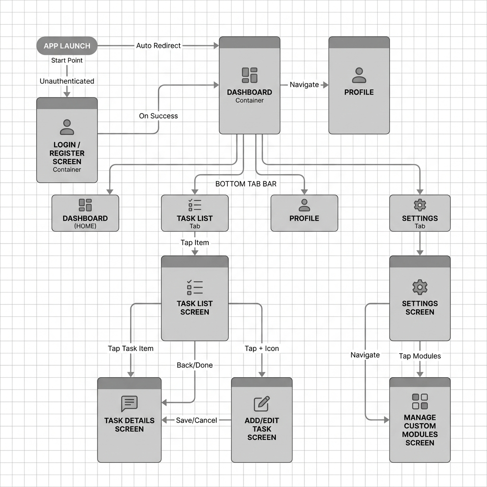

# Navigation Flow Diagram — Smart Student Planner



## Screen Transition Map

```
                    ┌──────────────┐
                    │  App Launch   │
                    └──────┬───────┘
                           │
                    ┌──────▼───────┐
                    │ Check Auth   │
                    │  (stored     │
                    │   session)   │
                    └──────┬───────┘
                           │
              ┌────────────┴────────────┐
              │                         │
       No Session                Has Session
              │                         │
     ┌────────▼────────┐      ┌────────▼────────┐
     │  LOGIN SCREEN   │      │   DASHBOARD     │
     │  ─────────────  │      │   (Home Tab)    │
     │  Email input    │      └────────┬────────┘
     │  Password input │               │
     │  [Sign In] btn  │      ┌────────┴────────┐
     │  [Sign Up] link │      │  BOTTOM TAB     │
     └───┬────────┬────┘      │  NAVIGATOR      │
         │        │           ├─────────────────┤
    Sign Up    Sign In        │ Home | Tasks |  │
         │        │           │ Profile | Set.  │
    ┌────▼────┐   │           └─────────────────┘
    │REGISTER │   │
    │ SCREEN  │   │
    │ ──────  │   │
    │ Name    │   │
    │ Email   │   │
    │ Pass    ├───┘
    │ Confirm │ (auto-login on success)
    └─────────┘


## Tab Navigation Detail

    ┌──────────────────────────────────────────────────┐
    │                BOTTOM TAB BAR                     │
    ├────────────┬────────────┬──────────┬─────────────┤
    │   Home     │   Tasks    │ Profile  │  Settings   │
    └─────┬──────┴─────┬──────┴────┬─────┴──────┬──────┘
          │            │           │            │
    ┌─────▼──────┐ ┌───▼──────┐ ┌──▼────────┐ ┌▼──────────┐
    │ DASHBOARD  │ │TASK LIST │ │ PROFILE   │ │ SETTINGS  │
    │            │ │          │ │           │ │           │
    │ Stats      │ │ Search   │ │ Avatar    │ │ Toggles   │
    │ Progress   │ │ Filters  │ │ Name edit │ │ Sort pref │
    │ Upcoming   │ │ Sort     │ │ Stats     │ │ App info  │
    │ FAB (+)    │ │ Cards    │ │ Logout    │ │ Clear all │
    └─────┬──────┘ └───┬──────┘ └───────────┘ └───────────┘
          │            │
          │      ┌─────▼──────┐
          │      │TASK DETAIL │
          │      │            │
          │      │ Full info  │
          │      │ [Edit] btn │
          │      │ [Delete]   │
          │      │ [Complete] │
          │      └─────┬──────┘
          │            │
          │      ┌─────▼──────┐
          │      │ EDIT TASK  │
          │      │            │
          │      │ Pre-filled │
          │      │ form       │
          │      │ [Save]     │
          │      └────────────┘
          │
    ┌─────▼──────┐
    │  ADD TASK   │
    │             │
    │ Title       │
    │ Module      │
    │ Due Date    │
    │ Priority    │
    │ Notes       │
    │ [Create]    │
    └─────────────┘


## User Flows

### Flow 1: First-Time User
Login Screen → Register Screen → Dashboard (auto-login)

### Flow 2: Returning User
App Launch → Auto-restore session → Dashboard

### Flow 3: Create a Task
Dashboard [FAB+] → Add Task → Fill form → Create → Back to Task List

### Flow 4: Manage a Task
Task List → Tap card → Task Detail → Edit / Delete / Complete

### Flow 5: Search Tasks
Task List → Type in search bar → Results filter in real-time

### Flow 6: Log Out
Profile Tab → Tap "Log Out" → Confirm → Login Screen
```

---

## Navigation Technology

- **React Navigation v6** (`@react-navigation/native`)
- **Native Stack Navigator** for performant screen transitions
- **Bottom Tab Navigator** for primary app sections
- **Conditional rendering** for auth vs. main flows (no linking between stacks)
