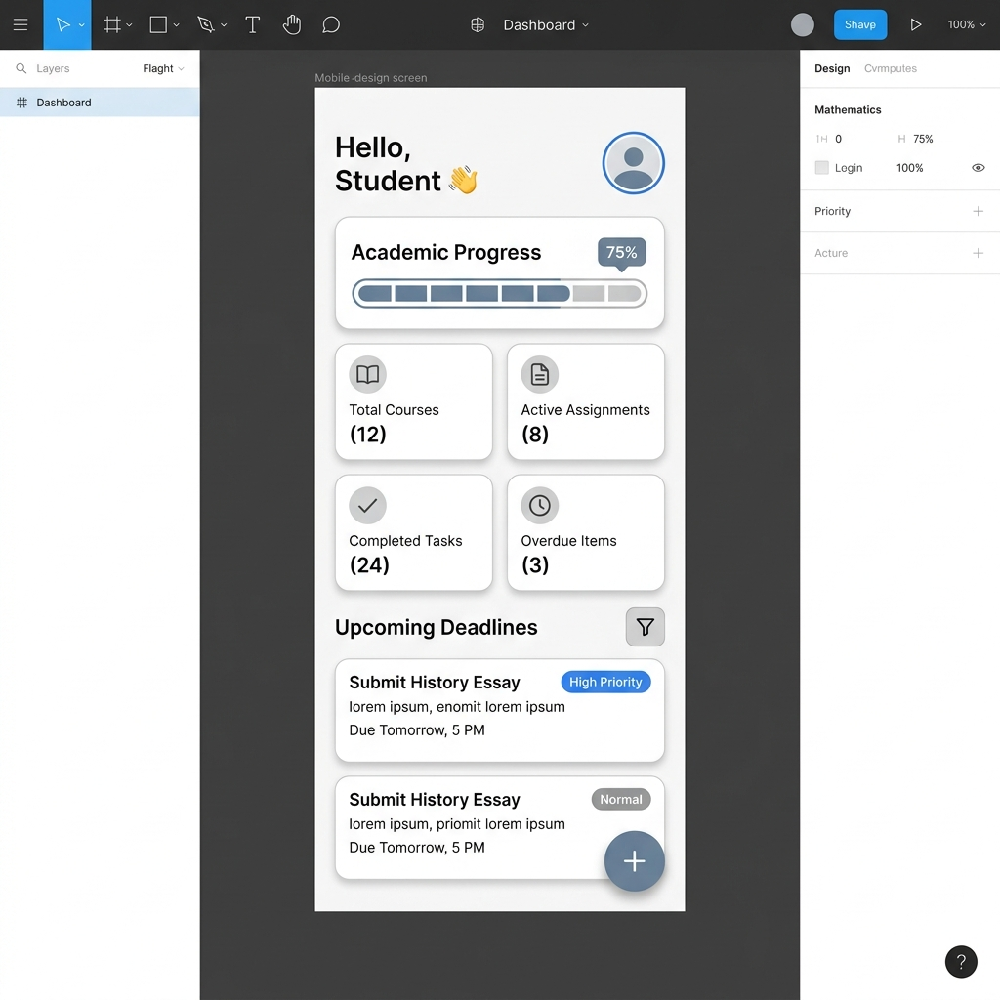

# UI Wireframes & Design Decisions — Smart Student Planner

## Design Philosophy

The application follows an **Apple HIG-inspired light & clean** aesthetic:

- **White surfaces** with soft off-white (#F8F9FD) backgrounds
- **Subtle shadows** (shadow opacity 0.06) for depth without heaviness
- **Rounded corners** (12–20px radii) for a friendly, modern feel
- **Blue primary accent** (#4A90D9) for interactive elements
- **Colour-coded priorities** — red/amber/green for instant visual scanning
- **Consistent spacing** via a 4px grid system (xs:4, sm:8, md:12, lg:16, xl:20, xxl:24)

---

## Screen Wireframes

### 1. Login Screen
```
┌─────────────────────────┐
│                         │
│      ┌───────────┐      │
│      │  📖 Icon  │      │
│      └───────────┘      │
│   Smart Student Planner │
│   Organise your life    │
│                         │
│  ┌───────────────────┐  │
│  │  Welcome Back     │  │
│  │  Sign in          │  │
│  │                   │  │
│  │  Email            │  │
│  │  ┌─────────────┐  │  │
│  │  │ ✉ you@...   │  │  │
│  │  └─────────────┘  │  │
│  │                   │  │
│  │  Password         │  │
│  │  ┌─────────────┐  │  │
│  │  │ 🔒 ••••••   │  │  │
│  │  └─────────────┘  │  │
│  │                   │  │
│  │  [  Sign In  ▶ ]  │  │
│  │                   │  │
│  │  Don't have an    │  │
│  │  account? Sign Up │  │
│  └───────────────────┘  │
│                         │
└─────────────────────────┘
```

### 2. Dashboard (Home)



```
┌─────────────────────────┐
│ Good Morning       (A)  │  A = avatar initial
│ Student Name            │
│                         │
│ ┌─────────────────────┐ │
│ │ Your Progress       │ │
│ │ 5 of 12 completed   │ │
│ │ ⚠ 2 overdue    42% │ │
│ └─────────────────────┘ │
│                         │
│ ┌────┐ ┌────┐ ┌────┐ ┌────┐
│ │ 12 │ │  7 │ │  5 │ │  2 │
│ │Tot │ │Act │ │Don │ │Ovd │
│ └────┘ └────┘ └────┘ └────┘
│                         │
│ Upcoming Tasks  See All │
│                         │
│ ┌─────────────────────┐ │
│ │▌ Lab Report     🔴  │ │
│ │  CS Module  Due tmrw │ │
│ └─────────────────────┘ │
│ ┌─────────────────────┐ │
│ │▌ Essay Draft    🟡  │ │
│ │  AI Module  3 days  │ │
│ └─────────────────────┘ │
│                    (＋) │  FAB
│ [Home] [Tasks] [Me] [⚙] │
└─────────────────────────┘
```

### 3. Task List
```
┌─────────────────────────┐
│ My Tasks         ↕ (+)  │
│                         │
│ ┌─────────────────────┐ │
│ │ 🔍 Search tasks...  │ │
│ └─────────────────────┘ │
│                         │
│ [All] [Active] [Done]   │
│                         │
│ ┌─────────────────────┐ │
│ │▌○ Task Title    🔴  │ │
│ │   Module  ·  3 days │ │
│ └─────────────────────┘ │
│ ┌─────────────────────┐ │
│ │▌✓ Task Title    🟢  │ │
│ │   Module  ·  Done   │ │
│ └─────────────────────┘ │
│                         │
│ [Home] [Tasks] [Me] [⚙] │
└─────────────────────────┘
```

### 4. Add Task Form
```
┌─────────────────────────┐
│ ← New Task              │
│                         │
│ Task Title *            │
│ ┌─────────────────────┐ │
│ │ ✏ Complete Lab...   │ │
│ └─────────────────────┘ │
│                     3/100│
│                         │
│ Module *                │
│ ┌─────────────────────┐ │
│ │ 🏫 Select module  ▾ │ │
│ └─────────────────────┘ │
│                         │
│ Due Date *              │
│ ┌─────────────────────┐ │
│ │ 📅 YYYY-MM-DD      │ │
│ └─────────────────────┘ │
│                         │
│ Priority *              │
│ (🔥High) (⚠Med) (🌿Low)│
│                         │
│ Notes                   │
│ ┌─────────────────────┐ │
│ │ Additional details  │ │
│ │                     │ │
│ └─────────────────────┘ │
│                  12/500  │
│                         │
│ [ Create Task ✓ ]       │
│ [ Cancel ]              │
└─────────────────────────┘
```

### 5. Task Detail
```
┌─────────────────────────┐
│ ← Task Details          │
│                         │
│ [In Progress]     🔴   │
│                         │
│ Complete Lab Report on  │
│ Neural Networks         │
│                         │
│ ┌─────────────────────┐ │
│ │ Module    AI Module │ │
│ │─────────────────────│ │
│ │ Due Date  15 Mar    │ │
│ │─────────────────────│ │
│ │ Time Left 3 days    │ │
│ │─────────────────────│ │
│ │ Created   10 Mar    │ │
│ └─────────────────────┘ │
│                         │
│ ┌─────────────────────┐ │
│ │ 📝 Notes            │ │
│ │ Remember to include │ │
│ │ diagrams and refs.  │ │
│ └─────────────────────┘ │
│                         │
│ [ Mark Complete ✓ ]     │
│ [ Edit ✏ ]  [ Delete 🗑]│
└─────────────────────────┘
```

---

## Colour Palette

| Token          | Hex       | Usage                        |
|----------------|-----------|------------------------------|
| Primary        | #4A90D9   | Buttons, links, accents      |
| Primary Light  | #E8F1FB   | Tinted backgrounds           |
| Success        | #00B894   | Completed states, low priority|
| Warning        | #FDCB6E   | Medium priority, due today   |
| Danger         | #E17055   | High priority, overdue, delete|
| Background     | #F8F9FD   | Page background              |
| Surface        | #FFFFFF   | Cards, elevated elements     |
| Text Primary   | #1A1D26   | Headings                     |
| Text Secondary | #6B7280   | Subtitles                    |
| Text Tertiary  | #9CA3AF   | Hints, placeholders          |

---

## Component Design System

All components use design tokens from `theme.js` to ensure consistency:

- **CustomButton**: 5 variants (primary/secondary/outline/danger/ghost), 3 sizes, icon support
- **TaskCard**: Elevated card with priority accent strip, checkbox, date info
- **PriorityBadge**: Colour-coded pill (High/Medium/Low)
- **SearchBar**: Animated border on focus, clear button
- **StatCard**: Dashboard metric tile with icon
- **EmptyState**: Friendly illustration placeholder with optional CTA
